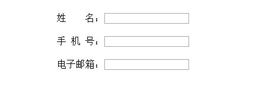

###CSS注意事项
---
* a标签里面不能嵌套a标签，如果嵌套了，浏览器默认会把a标签里面的a标签放到外部来
* 选择器优先级：<pre><code>
	!important: 2000
	内联样式： 1000
	ID选择器： 100
	类选择器（包括属性选择器和伪类）： 10
	元素(标签)和伪元素选择器： 1
	结合符和通配符： 0
</code></pre>

<code>&nbsp;</code> 半角的不断行的空白格（推荐使用）
<code>&ensp;</code>  半角的空格 
<code>&emsp;</code>  全角的空格

详细的含义：

`&nbsp;`：这是我们使用最多的空格，也就是按下space键产生的空格。在HTML中，如果你用空格键产生此空格，空格是不会累加的（只算1个）。要使用html实体表示才可累加。该空格占据宽度受字体影响明显而强烈。在inline-block布局中会搞些小破坏，在两端对齐布局中又是不可少的元素。

`&ensp;`：此空格有个相当稳健的特性，就是其占据的宽度正好是1/2个中文宽度，而且基本上不受字体影响。

`&emsp;` ：此空格也有个相当稳健的特性，就是其占据的宽度正好是1个中文宽度，而且基本上不受字体影响。

<code>
	<ul>
    <li class="li">姓&emsp;&emsp;名：<input type="text" /></li>
    <li class="li">手&ensp;机&ensp;号：<input type="text" /></li>
    <li class="li">电子邮箱：<input type="text" /></li>
	</ul>
</code>

