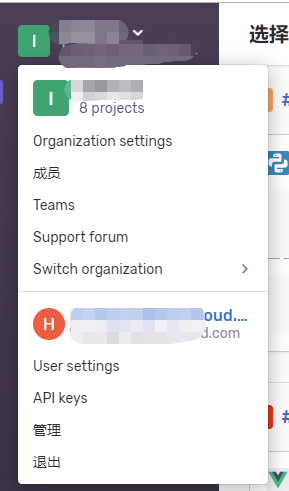

## sentry-cli 操作
['官方说明'](https://docs.sentry.io/cli/)

1. 先在后台生成token



2. 登录

sentry-cli --url [sentry后台的域名] login

3. 新建版本

```
sentry-cli releases -o [organization] -p [project name] new [版本号]
eg:
sentry-cli releases -o vue-org -p vue new master@3.0
```

4. 上传文件

```
sentry-cli releases -o 组织名 -p 项目名 files 版本号 upload-sourcemaps 打包后js的目录 --url-prefix 线上js访问地址

sentry-cli releases -o sentry -p vue files dev@1.0.1 upload-sourcemaps dist\static\js --url-prefix ~/static/js
```

特别注意！！，这个 --url-prefix 是你线上访问到js文件的路径，~ 就是你网站的根目录，比如我网站的静态文件是这样 http://192.168.144.163:8080/static/js/xxxx.js，那么按照上面例子填就是正确的，因为我网站根目录就是 http://192.168.144.163:8080，上传成功后可以在 Releases -> Artifacts 中看到刚才上传的文件

5. 删除某个版本的map文件
```
sentry-cli releases -o 组织名 -p 项目名 files 版本号 delete --all

sentry-cli releases -o sentry -p vue files dev@1.0.1 delete --all
```

6. 注意点

如果使用了nginx，上传map文件的时候可能会出现413 unknow error
解决方法：
``` bash
# buffer larger messages
client_max_body_size 5m;
client_body_buffer_size 100k;
```
大小可以自己根据文件大小设置
