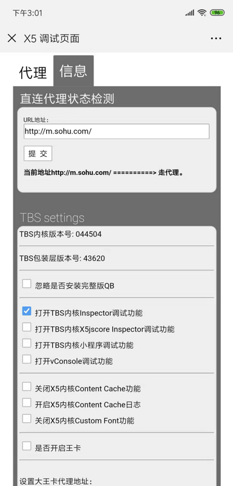

## 微信开发相关

1. 菜单长度
菜单创建接口一级菜单不超过16字节，子菜单不超过60字节
2. 微信支付
同一个主体的公众号可以公用一个微信商户号
3. 页面白屏
微信支付后立即跳转到其他页面有一定几率出现白屏（长按屏幕可以复制出文字或图片地址），解决方案：

``` js
// 延迟跳转即可解决
setTimeout(() => {
  window.location.replace('/payment/success') // 跳转逻辑
}, 500)
```

> 微信内置浏览器的 bug，**图片无法批量上传**也可以通过 `setTimeout` 方法解决


### 微信调试

1. android 端的微信
+ 首先打开[http://debugx5.qq.com](http://debugx5.qq.com)或者扫描下面二维码

  
+ 打开微信 TBS 调试



2. android用usb调试

[TBS debugger](https://x5.tencent.com/tbs/guide/debug/faq.html)

3. 开源的debugger工具

[https://github.com/wuchangming/spy-debugger](https://github.com/wuchangming/spy-debugger)

4. ios 调试需要安装证书，证书安装以后要执行以下设置

设置->通用->关于本机->证书信任设置-> 找到node-mitmproxy CA（打开）